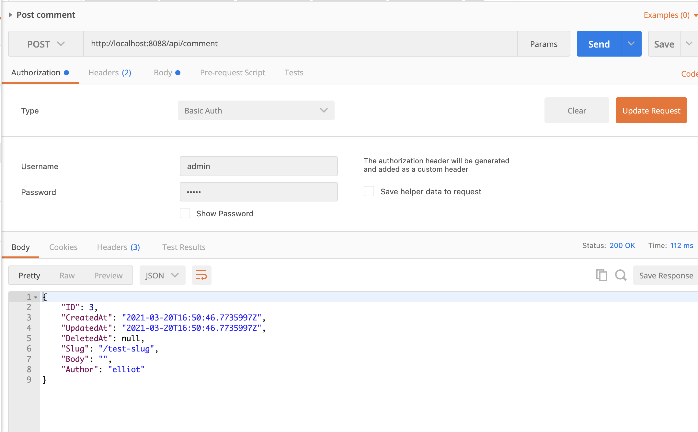

# updev-go-rest-api-course
Example project https://tutorialedge.net/courses/go-rest-api-course/02-project-setup/

### command
 - ทำการกำหนด module
    ```powershell
    D:\GO\go mod init github.com/ksupdev/updev-go-rest-api-course
    ```

 - Create directory cmd/service และทำการสร้าง ``main.go`` ภายใต้ folder นั้นด้วย
    ```powershell
    mkdir cmd/server
    ```
    ```GO
    [filename : main.go]
    package main

    import "fmt"

    func main(){
        fmt.Println("GO REST API Course")
    }
    ```
    ทำการทดสอบ 

    ``` powershell
    PS D:\GO\updev-go-rest-api-course> go run .\cmd\server\main.go
    GO REST API Course
    ```

- ทำการสร้าง ส่วนของการ Connect database โดยการใช้ struct ที่มีการระบุการทำงานให้เป็นแบบ pointers ** ใน GO เราสามารถเลือกได้ว่า Struct ที่เราสร้างขึ้นนั้นจะมมีการทำงานแบบ pointers หรือจะให้เป็นแต่ value ธรรมดา
    ```GO
    package main

    import "fmt"

    // App - the struct which contains thinks like pointers
    // to database connections
    type App struct{}

    // Run setup our application
    func (app *App) Run() error {
        fmt.Println("Setting Up Our App")
        return nil
    }


    func main(){
        fmt.Println("GO REST API Course")
        app := App{}
        if err := app.Run(); err != nil{
            fmt.Println("Error starting up our REST API")
            fmt.Println(err)
        }

    }
    ```
    
    ```GO
    func (app *App) Run() error {
        fmt.Println("Setting Up Our App")
        return nil
    }
    ```
    เป็นการประกาศ Method Run สำหรับ App struct{}

- Implementing the Transport Package (health check)
    ```powershell
    PS D:\GO\updev-go-rest-api-course>mkdir internal
    PS D:\GO\updev-go-rest-api-course\internal>mkdir transport
    PS D:\GO\updev-go-rest-api-course\internal\transport>mkdir http
    ```
    ทำการสร้าง ``handler.go``

    ```GO

    ```

    ทำการ implement "github.com/gorilla/mux"

    ```powershell
    PS D:\git-myself\GO\go-projects\labs\updev-go-rest-api-course> go get github.com/gorilla/mux                                                                               
    PS D:\git-myself\GO\go-projects\labs\updev-g
    go: downloading github.com/gorilla/mux v1.8.0
    go get: added github.com/gorilla/mux v1.8.0

    ```
    และทำการ Implement ``handler.go`` เพื่อทำการจัดการ Routes ตามที่มีการ Request เข้ามา ซึ่งก็คือจะทำการรับ request ``/api/health``และทำการ response ``I'm alive!``


    และทำการ implement net/http เพื่อใช้สำหรับรับ Http Request และส่วไปให้ handler.goเป็นคนจัดการกับ Request นั้นๆ

    ทำการทดสอบ

    ```powershell
    PS D:\git-myself\GO\go-projects\labs\updev-go-rest-api-course> go run .\cmd\server\main.go
    GO REST API Course
    Setting Up Our App
    Setting Up Routes
    
    ..... New terminal

    PS D:\git-myself\GO\go-projects\labs\updev-go-rest-api-course> curl http://localhost:8080/api/health
    StatusCode        : 200
    StatusDescription : OK
    Content           : I'm alive!
    ```

- Running Postgres Locally with Docker
    Getting a docker instance up and running locally using docker
    ```docker
    docker run --name some-postgres -e POSTGRES_PASSWORD=postgres -p 5432:5432 -d postgres

    PS D:\git-myself\GO\go-projects\labs\updev-go-rest-api-course> docker ps
    CONTAINER ID   IMAGE      COMMAND                  CREATED          STATUS          PORTS                    NAMES
    f7cf9e4973b6   postgres   "docker-entrypoint.s…"   22 seconds ago   Up 21 seconds   0.0.0.0:5432->5432/tcp   some-postgres

    ```
- Implementing the Database Package
    
    Create a new directory within `internal` directory called ``database``
    ```
    mkdir .\internal\database 
    ```

    Create a new file called database.go และทำการ import GORM และ postgress driver ของ สำหรับ gorm
    ```GO
        import (
            "fmt"

            "github.com/jinzhu/gorm"
            _ "github.com/jinzhu/gorm/dialects/postgres"
        )
    ```
    จาก Code จะเห็นว่ามีการ ใช้ ``_`` อยู่หน้า ``github.com/jinzhu/gorm/dialects/postgres`` นั้นเป็นการบอกว่าเป็นการ Import ในส่วนของ module ที่มีการเกี่ยวข้อง หรือมีผลกับ module ด้านบน

    ทำการ run command เพื่อ Download modulec และติดตั้งใน project

    ```powershell
    PS D:\git-myself\GO\go-projects\labs\updev-go-rest-api-course> go get github.com/jinzhu/gorm
    go: downloading github.com/jinzhu/gorm v1.9.16
    go: downloading github.com/jinzhu/inflection v1.0.0
    go get: added github.com/jinzhu/gorm v1.9.16
    PS D:\git-myself\GO\go-projects\labs\updev-go-rest-api-course> go get github.com/jinzhu/gorm/dialects/postgres
    go: downloading github.com/lib/pq v1.1.1
    ```

    ทำการ Implement ในส่วน defind dtabase properties และส่วนของการ Connect database ที่ ``file database.go``


    ทำการ run เพื่อ Test 
    ``` powershell
    PS D:\git-myself\GO\go-projects\labs\updev-go-rest-api-course> go run .\cmd\server\main.go
    GO REST API Course
    Setting Up Our App
    Setting up new database connection
    Setting Up Routes

    ```

    ในไฟล์ ``main.go``
    ```GO
	var err error
	_, err = database.NewDatabase()
	if err != nil {
		return err
	}
    ```
    จาก Code เราจะเห็น ``_, err = database.NewDatabase()`` เราสามารถเลือกที่จะไม่รับการค่า ที่ได้รับการ return มาจาก method ได้ โดยการใช้ underscode ``_``

- Defining the Comment Service
        ```GO
        [filename : comment.go]

        type Service struct {
            DB *gorm.DB
        }

        func NewService(db *gorm.DB) *Service {
            return &Service{
                DB: db,
            }
        }
        ```
        >ถ้าเราสังเกตดีๆจะพบว่า ทำไมถึงมีการ ``return &Service{.....`` จากที่พยายามไปหาข้อมูลมา มันคือ 
        
        [Constructors and composite literals](https://golang.org/doc/effective_go#composite_literals) หรือมันก็คือการ
        Return ค่าพร้อมกับการกำหนด value ให้กับ Struct นั้นเอง

- Implementing our Comment service
    ทำการสร้าง Method สำหรับ struct Service
    ```GO
    [filename : comment.go]

    // Comment - defines our comment struct
    type Comment struct {
        gorm.Model
        Slug   string
        Body   string
        Author string
    }
    

    func (s *Service) GetComment(ID uint) (Comment, error){}

    // GetCommentsBySlug - retrieves all comments by slug (path -/article/name/)
    func (s *Service) GetCommentsBySlug(slug string) ([]Comment, error) {}

    func (s *Service) PostComment(comment Comment) (Comment, error) {}

    func (s *Service) UpdateComment(ID uint, newComment Comment) (Comment, error) {}

    func (s *Service) DeleteComment(ID uint) error {}

    func (s *Service) GetAllComments() ([]Comment, error) {}
    ```

- Implementing The Comment REST API Endpoints
    > Convert string to uint by ``strconv`` [REF](https://golang.org/pkg/strconv/)
    ``` GO
     id := vars["id"]
	 i, err := strconv.ParseUint(id,10,64)
     var intNumber uint   = uint(i)
    ```

- Migrating Our Database and Testing our Endpoints Manually
    Create ``migration.go`` [migrate command](https://gorm.io/docs/migration.html)
    ```GO
    func MigrateDB(db *gorm.DB) error {
        if result := db.AutoMigrate(&comment.Comment{}); result.Error != nil {
            return result.Error
        }
        return nil
    }
    ```
    โดย Method นี้ จะทำการ auto generate database schema

- Handling JSON
    สร้าง Struct Response สำหรับเป็นโครงสร้างสำหรับ Response สำหรับ Response ข้อมูลในรูปแบบ JSON
    ```GO
    [filename:handler.go]

    type Response struct {
        Message string
    }
    ```

    ในส่วนของการ Handler request ``/api/health`` จากที่ใรตอนแรกเราทำการ Response โดยการใช้ ``fmt.Fprintf(w, "I'm alive!")`` เพื่อทำการ Return ค่าแต่ตอนนี้เราจะทำการให้มีการ Response ในรูปแบบ JSON พร้อมกับทำการกำหนด Http status และ Header เพื่อระบุว่ามีการ Response ค่าในรูปแบบ JSON

    ```GO
        h.Router.HandleFunc("/api/health", func(w http.ResponseWriter, r *http.Request) {
            // fmt.Fprintf(w, "I'm alive!")
            w.Header().Set("Content-type", "application/json; charset=UTF-8")
            w.WriteHeader(http.StatusOK)
            if err := json.NewEncoder(w).Encode(Response{Message: "I am Alive"}); err != nil {
                panic(err)
            }
        })
    ```

    > จากด้่นบนสิ่งที่น่าสนใจคือการใช้ ``panic(err)`` เพื่อทำการจัดการ กรณีที่เกิด Error จากที่ได้อ่านดูมันคล้ายกับการ throw exception [REF](https://www.geeksforgeeks.org/panic-in-golang/)

- Handling Errors
    Implement sendErrorResponse and replace ``fmt.Fprintf(w, "Failed to delete comment by comment id")`` with this method
    ```GO
    [filename : handler.go]
    func sendErrorResponse(w http.ResponseWriter, message string, err error) {
        w.WriteHeader(http.StatusInternalServerError)
        if err := json.NewEncoder(w).Encode(Response{Message: message, Error: err.Error()}); err != nil {
            panic(err)

        }
    }
    ```

- Containerizing our Go Apps with Docker
    Create Dockerfile in root directory
        > standard_init_linux.go:219: exec user process caused: no such file or directory ทำการ fix โดยการ เพิ่ม ``GOARCH=amd64``
    ```powershell
    //Build commmand
    docker build -t comments-api . 

    karoon@Nuttakorns-MacBook-Pro updev-go-rest-api-course % docker run -it -p 8088:8088 comments-api
    GO REST API Course
    Setting Up Our App
    Setting up new database connection
    Error starting up our REST API
    dial tcp 127.0.0.1:5432: connect: connection refused
    ```
    หลังจากเราลองทำการ run image ที่เราได้ทำการ Build เราก็พบ Error ตามตัวอย่างด้านบน จาก Error เราสามารถรู้ได้ทันทีว่าน่าจะเกี่ยวกับ การเชื่อมต่อกับตัว postgres db นั้นเอง

- Docker-compose for our Go Services
    Create file docker componse
    Run docker compose
    ``` powershell
    docker-compose up --build
    ```

- Acceptance Tests with Resty
  การติดตั้ง Package เราสามารถไป coppy package ที่เราต้องการมาไว้ที่ go.mod ได้เลย แล้วทำการ run ``go mod tidy`` จากด้านล่าง
  เราแค่ coppy ``github.com/go-resty/resty/v2 v2.5.0`` มาและทำการ Run cpmmand
  ``` GO
    module github.com/ksupdev/updev-go-rest-api-course

    go 1.16

    require (
        github.com/go-resty/resty/v2 v2.5.0
        github.com/gorilla/mux v1.8.0
        github.com/jinzhu/gorm v1.9.16
    )
  ```

  ```powershell
    aroon@Nuttakorns-MacBook-Pro updev-go-rest-api-course % go mod tidy
    go: finding module for package github.com/go-resty/resty/v2
    go: downloading github.com/go-resty/resty v1.12.0
    go: downloading github.com/go-resty/resty/v2 v2.5.0
    go: found github.com/go-resty/resty/v2 in github.com/go-resty/resty/v2 v2.5.0
  ```

  run test command 
    % go test ./... -tags=e2e -v

- Running K8s Locally With Kind

- Logging with Logrus
    Install ``github.com/sirupsen/logrus``
    ```powershell
        go get github.com/sirupsen/logrus
    ```

- Logging Middleware
    - ทำการแยกส่วนของ comments endpoint ออกมากจาก ``handler.go`` ไปไว้ใน ``comment.gp`` ซึ่งอยู่ใน Package เดียวกัน
    > จากการสังเกตจะเห็นว่า file ``handler.go`` และ ``comment.go`` สามารถทำการอ้างถึงกันได้โดยทันที แต่กรณีที่มีการเรียกใช้ pacakge อื่นนั้นจะเป็นการเรียก โดยจะอ้างถึง ``module`` ที่มีการกำหนดไว้ใน module.go และต่อด้วย path ที่ package นั้นอยู่ เช่น ``github.com/ksupdev/updev-go-rest-api-course/internal/transport/http`` module คือ github.com/ksupdev/updev-go-rest-api-course และ path ของ package คือ nternal/transport/http

- Basic Auth Middleware
    Implement method สำหรับการตรวจสอบ Basic auth 

    ```GO
    // BasicAuth - a handy middleware function that will provide basic auth around specific endpoint
    func BasicAuth(original func(w http.ResponseWriter, r *http.Request)) func(w http.ResponseWriter, r *http.Request) {
        return func(w http.ResponseWriter, r *http.Request) {
            log.Info("basic auth endpoint hit")
            user, pass, ok := r.BasicAuth()
            if user == "admin" && pass == "admin" && ok {
                original(w, r)
            } else {
                w.Header().Set("Content-Type", "application/json; charset=UTF-8")
                sendErrorResponse(w, "not authorized", errors.New("not authorized"))
            }

        }
    }
    ```

    โดยหลักการก็คือเราได้ทำการออกแบบให้ method นี้ทำการรับ argument เป็น Method ที่จะมีการทำงานหลังจากที่ผ่านการตรวจสอบในส่วนของ Basic authen

    > ``errors`` ใช้ในการสร้าง error message ``errors.New("not authorized")``
    
    ตัวอย่างการนำไปใช้
    ``` GO
    func (h *Handler) SetupRoutes() {
        // fmt.Println("Setting Up Routes")
        log.Info("Setting Up Routes")
        h.Router = mux.NewRouter()
        h.Router.Use(LoggingMiddleware)

        h.Router.HandleFunc("/api/comment", h.GetAllComments).Methods("GET")
        h.Router.HandleFunc("/api/comment", BasicAuth(h.PostComment)).Methods("POST")
        h.Router.HandleFunc("/api/comment/{id}", h.GetComment).Methods("GET")
        h.Router.HandleFunc("/api/comment/{id}", BasicAuth(h.UpdateComment)).Methods("PUT")
        h.Router.HandleFunc("/api/comment/{id}", BasicAuth(h.DeleteComment)).Methods("DELETE")
        h.Router.HandleFunc("/api/health", func(w http.ResponseWriter, r *http.Request) {
            // fmt.Fprintf(w, "I'm alive!")
            w.Header().Set("Content-type", "application/json; charset=UTF-8")
            w.WriteHeader(http.StatusOK)
            if err := json.NewEncoder(w).Encode(Response{Message: "I am Alive"}); err != nil {
                panic(err)
            }
        })
    }
    ```
    วิธีในการทดสอบผ่าน postman
    
    


 
 